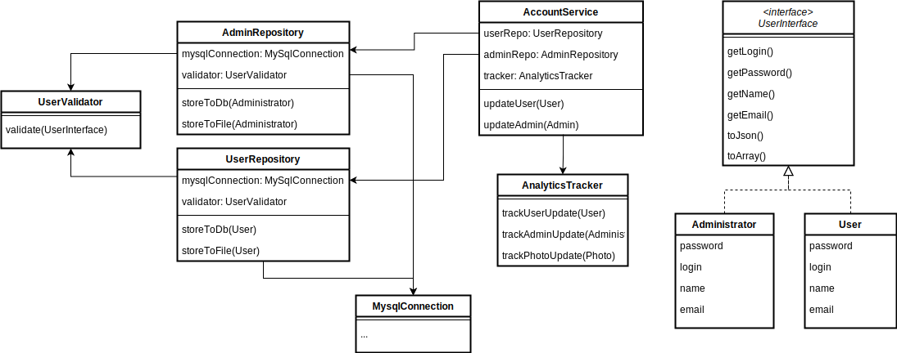

## Agenda
В нашем гипотетическом проекте есть сервис для работы с учетными данными пользователя. Он отвечает за изменение данных пользователей и администраторов, а также трекинг таких изменений в аналитическую систему.

Сервис был спроектирован давно, изначально он записывал данные только в БД, затем появилась необходимость записывать данные в файл для тестов (и ее добавили), а затем мы начали записывать в аналитику изменения и других сущностей.  

Сейчас стало очевидно, что при такой структуре и схеме добавления функционала, дальнейшее развитие сервиса станет затрудняться. По этому стоит перепроектировать классы и зависимости для возможности легко расширять решение. 

## ToDo:
Провести анализ диаграммы классов решения, дать рекомендации как спроектировать его более легким для расширения и поддержки. 

### Уточнения
- Можно отталкиваться от принципов SOLID
- Если в вашем решении будут использоваться схемы, то используйте любой удобный формат (даже фото блокнота:)
- Не стоит указывать больше функционала и деталей реализации, чем уже есть на диаграмме

### Текущее решение
Диаграмма классов:

