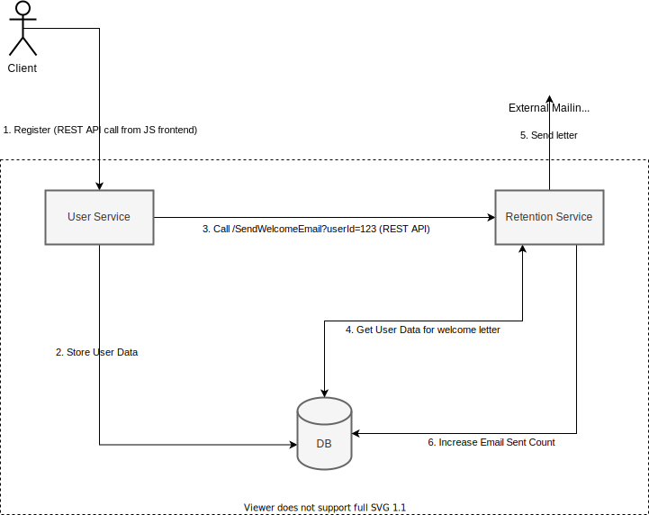

## Agenda
Наш основной проект - довольно популярный и нагруженый продукт, а также содержит в себе много бизнес логики.
Для получения возможности продуктивно масштабировать команду и нагрузки, мы решили перевести его с монолитной архитектуры на микросервисную.
Первым шагом будем выделять сервис обработки пользовательских данных (User Service) и сервис, который отвечает за возврат пользователя на продукт (Retention Service) путем отправки почтовых и других уведомлений.

Один из разработчиков проявил инициативу и предложил своё видение такого разделения на примере отправки Welcome Letter при регистрации пользователя.

## ToDo:
Провести ривью решения, которое предложил разработчик:

### Решаемая разработчиком задача
- Разделить монолит на два микросервиса: пользовательских данных (User Service) и отправки почты (Retention Service)
- Разделение необходимо для возможности автономно развивать разные части приложения и автономно их масштабировать
- Поддержкой сервисов после разделения будут заниматься разные команды
- Показать, как при таком разделении будут взаимодействовать сервисы, решая задачу отправки письма пользователю после его регистрации на сайте
- Отправка писем осуществляется через сторонний сервис отправки почты
- При формировании письма требуются данные пользователя, и, в будущем, мы будем эксперементировать с шаблонами и их наполнением
- Данные о количестве отосланых пользователю писем должны сохранятся

### Решение разработчика
Схема взаимодействия:



Описание решения:

Предложено использовать два сервиса и одну базу данных. Общение между сервисами по REST API протоколу. Схема взаимодействий для поставленой задачи:
1. Пользователь регистрируется отправляя REST API запрос на User Service (US)
2. US валидирует и сохраняет данные пользователя в DB
3. US отправляет REST API запрос (GET) на Retention Service (RS) по адресу ```/SendWelcomeEmail?userId=123```
4. RS читает нужные данные пользователя из DB, формирует письмо
5. RS отправляет сформированное письмо через сторонний сервис отправки почты
6. RS увеличивает количество отправленых писем для пользователя в DB

## Уточнения
- Ривью можно провести указав минусы принятых разработчиком решений и предложив своё решение задачи.
- Если в вашем решении будут использоваться схемы, то используйте любой удобный формат (даже фото блокнота:)
