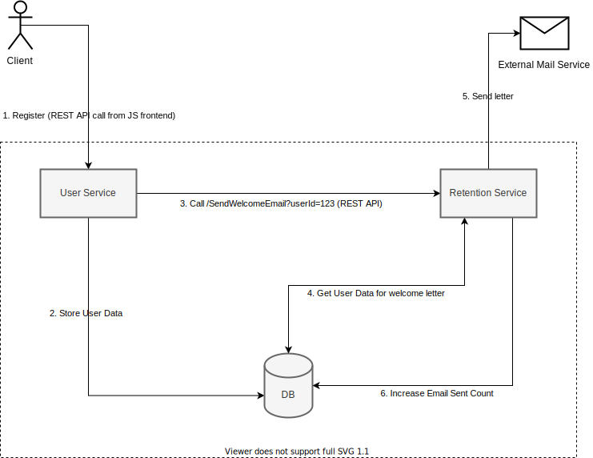

## Agenda
Наш гипотетический проект - нагруженный монолит, который содержит в себе много бизнес логики.
Для получения возможности масштабировать продукт и команду разработки, было принято решение мигрировать с монолитной архитектуры на микросервисную.
Первым шагом будем выделять сервис обработки пользовательских данных (User Service) и сервис, который отвечает за возврат пользователя на продукт (Retention Service) путем отправки почтовых и других уведомлений.

Один из разработчиков проявил инициативу и предложил своё видение такого разделения. Свое решение он показал на примере кейса отправки емейла "Welcome Letter" при регистрации пользователя на продукте.

## ToDo:
Провести анализ решения, которое предложил разработчик

### Уточнения
- Анализ можно провести указав минусы принятых разработчиком решений и предложив своё решение задачи.
- Если в вашем решении будут использоваться схемы, то используйте любой удобный формат (даже фото блокнота:)

### Решаемая разработчиком задача
- Разделить монолит на два микросервиса: пользовательских данных (User Service) и отправки почты (Retention Service)
- Показать, как при таком разделении будут взаимодействовать сервисы, на примере задачи отправки письма пользователю после его регистрации на сайте

### Дополнительные данные
- Пользователь регистрируется через User Service и заполняет набор информации о себе
- Для формирования письма, сервису Retention Service требуется лишь определенная часть данных из информации о пользователе
- Информация о количестве отправленных пользователю писем должна быть сохранена для дальнейшего использования в User Service
- Retention Service будет развиваться отдельной командой и включать разные логики уведомлений

### Решение разработчика
Схема взаимодействия:



Описание решения:

Предложено использовать два сервиса и одну общую базу данных. Общение между сервисами осуществляется по REST API протоколу. 
Схема взаимодействий сервисов, при отправке письма пользователю:
1. Пользователь регистрируется, отправляя REST API запрос на User Service (US)
2. US валидирует и сохраняет данные пользователя в DB
3. US отправляет REST API запрос (GET) на Retention Service (RS) по адресу ```/SendWelcomeEmail?userId=123```
4. RS читает нужные данные пользователя из DB, формирует письмо
5. RS отправляет сформированное письмо через сторонний сервис отправки почты
6. RS увеличивает счетчик количества отправленных пользователю писем в DB
